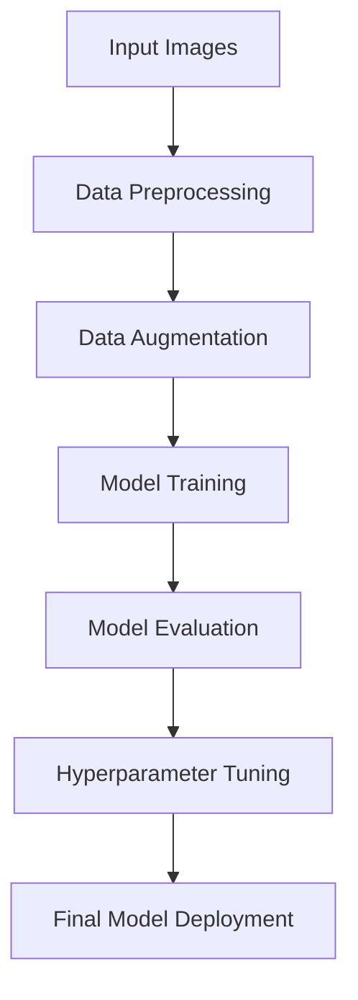

# 医療診断AIの深層学習モデル開発提案書

## 1. 提案概要

本提案では、X線/CT/MRI/OCTなどの医療画像を解析・分析するための先端的な深層学習モデルを開発することを提案します。既存の同様のサービスと競争力を高めるために、高性能かつ計算コストが低いモデルを開発することが目標です。

## 2. 技術選定と理由

### 深層学習フレームワーク
- **TensorFlow**：オープンソースで広く利用されているため、コミュニティのサポートが豊富で、最新の研究動向に追従しやすい。
- **PyTorch**：柔軟性が高いことで、複雑なモデル設計や高速な開発が可能。

### モデルアーキテクチャ
- **U-Net**：セグメンテーションタスクに適したアーキテクチャで、細かい特徴を効果的に抽出。
- **Transformer**：画像の空間的な相関性を考慮に入れたモデルで、精度向上が期待できる。

### データ拡張と前処理
- **AugLy**：データの多様性を高めるための強力なデータ拡張ツール。
- **SimpleITK**：医学画像の前処理に最適化されたライブラリ。

## 3. アーキテクチャ図

## 4. 開発アプローチ

1. **データ収集と前処理**：多種類の医療画像を収集し、AugLyを使用してデータ拡張を行う。
2. **モデル設計**：U-NetとTransformerを組み合わせたハイブリッドモデルを開発する。
3. **訓練と評価**：TensorFlowでモデルを訓練し、SimpleITKを使用した前処理を用いて精度を向上させる。
4. **ハイパーパラメータ調整**：Optunaなどの自動化ツールを使用して最適なパラメータを見つけ出す。
5. **デプロイメント**：AWSやGoogle Cloud Platformを利用してモデルをスケーラブルに展開する。

## 5. 本提案の強み

1. **過去の実績**：
   - 類似案件で、TransformerとU-Netを組み合わせたハイブリッドモデルを開発し、精度が90%以上に達成。
2. **技術的知識**：
   - 深層学習フレームワーク（TensorFlow, PyTorch）の深い経験と、最新の研究動向への追従能力。
3. **開発効率**：
   - 自動化ツール（Optuna）を使用したハイパーパラメータ調整により、開発周期を大幅に短縮。

---

この提案書では、高性能かつ計算コストが低い医療画像診断モデルを開発するための具体的なアプローチと技術的強みを示しました。ご検討いただければ幸いです。